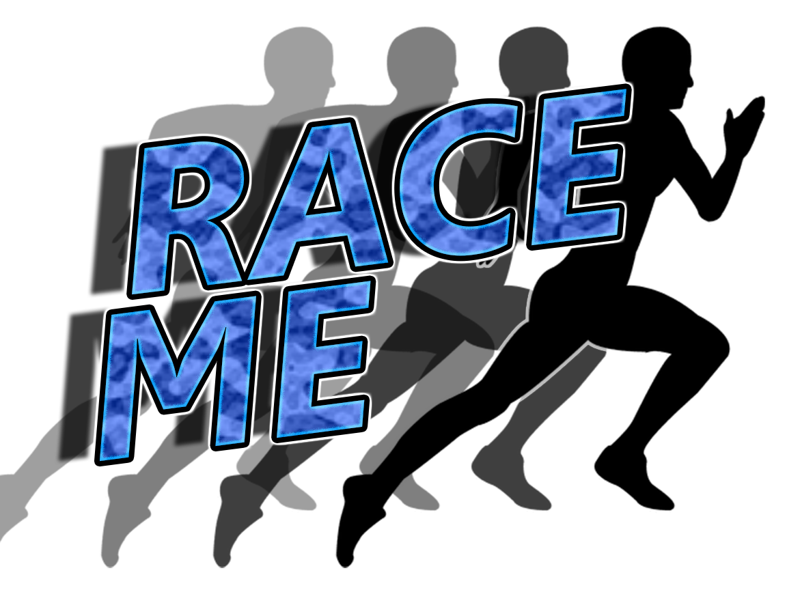

<!-- PROJECT LOGO -->
 

  

  <h3 align="center">RaceMe Xamarin Forms App</h3>

  

    A mobile route calculating application.
     
    <a href="https://github.com/othneildrew/Best-README-Template"><strong>Explore the docs »</strong></a>
     
     
    <a href="https://github.com/othneildrew/Best-README-Template">View Demo</a>
    ·
    <a href="https://github.com/othneildrew/Best-README-Template/issues">Report Bug</a>
    ·
    <a href="https://github.com/othneildrew/Best-README-Template/issues">Request Feature</a>
  

<!-- TABLE OF CONTENTS -->
## Table of Contents

* [About the Project](#about-the-project)
  * [Built With](#built-with)
* [Getting Started](#getting-started)
  * [Prerequisites](#prerequisites)
  * [Installation](#installation)
* [Homework](#homework)
<!--
* [Usage](#usage)
* [Roadmap](#roadmap)
* [Contributing](#contributing)
* [License](#license)
* [Contact](#contact)
* [Acknowledgements](#acknowledgements)
-->

<!-- ABOUT THE PROJECT -->
## About The Project
Race Me - Hybrid App
Hybrid Mobile Fitness app. Allows user to select a distance and then generates several circular routes that both start and end at their current location. Users are able to select one of these generated routes and have their data recorded along the way. The selected route along with the users data is saved when the route is completed. Users can then go back to routes they have run previously and run against themseleves (their ghost) in realtime, TM Nations style. Eventually users will be able to view other people routes and run against them, and set times on their routes etc.

### Built With
* [C#](https://getbootstrap.com)
* [Xamarin](https://visualstudio.microsoft.com/xamarin/)

<!-- Communication -->
### Communication
Weekly meetings will take place on google hangout every Wednesday at 9pm
at: https://hangouts.google.com/call/-Au_vyKWYBfpQYYc80nBAEEI

<!-- GETTING STARTED -->
## Getting Started

To get a local copy up and running follow these simple example steps.

### Prerequisites

This is an example of how to list things you need to use the software and how to install them.
##### 1. Install Visual Studio Tools for Xamarin
https://visualstudio.microsoft.com/xamarin/
##### 2. Locate and install the workload : 'Mobile Development with .net' under the Mobile and Gaming Section

### Installation

##### 1. Open Visual Studio
##### 2. Clone the repo
Click Clone or Checkout Code
Copy repo URL into Repository Location field and click Clone
##### 3. Open Solution & Run App on Emulator

### Login Details

##### Email
Duncansmallwood@yahoo.com
##### Password
Password1

<!-- HOMEWORK -->
## Homework
#### Due date 2019/11/06
##### Damian
- [ ] Add a app splash screen
- [ ] Add little icons for forms and things
- [ ] Create custom component
- [ ] Api Billing test
- [ ] Button Clicks on menu 
- [ ] User image 

##### Duncan
- [x] Refactor documentation
- [x] Add native firebase email authentication
- [x] Wire a login screen to use the authentication
- [x] Add 2 steps moving forward
- [ ] Research naming object being stored in DB.
- [ ] Look into Google Auth
- [ ] Store a route programatically. Fields (title, time, distance)

##### Matt
- [x] Add 2 steps moving forward
- [x] Comment code
- [ ] Create a location service
- [ ] Plot a route on a map
- [ ] Track location
- [ ] Geocode coords
- [ ] Find out about google maps API key billing https://console.cloud.google.com/freetrial/signup/billing/ZA

#### Steps moving forward
##### Matt
- Setup route CRUD
- Generate a route based on a distance entered (can be a straight line or wateva)
- Get a working Google maps API key
- Get app working on actual android device.
- Add app icon
- Add a splash screen
- Get a working google maps API key
- Get images working
- Since our repo is public, we need to add any files where the Google API key is visible, to gitIgnore
- Show spinner when logging in
- Flesh out a route card in the UI
##### Damian
- Turn Gps location into an address (for displaying purposes)
- Free run ??(creates a route off of an actual run)
##### Duncan
- Add Facebook and Google login
- Add Register User Functionality

